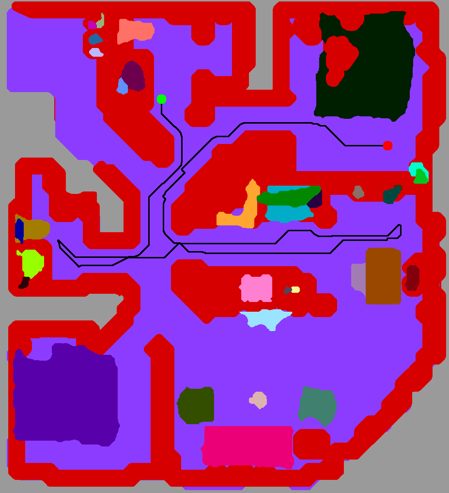

<h1 align="center">

Optimal Scene Graph Planning with Large Language Model Guidance

[Project Page](https://existentialrobotics.org/pages/llm-planning) | [Paper](https://arxiv.org/abs/2309.09182)

</h1>

<br>

This repository contains an implementation accompanying the paper Optimal Scene Graph Planning with Large Language Model
Guidance, IEEE ICRA 2024. If you find this code useful, we would appreciate if you could cite our work:

- [1] Z. Dai, A. Asgharivaskasi, T. Duong, S. Lin, M. Tzes, G. J. Pappas, N. Atanasov, [**Optimal Scene Graph Planning
  with Large Language Model Guidance**](https://arxiv.org/abs/2309.09182), IEEE International Conference on Robotics and
  Automation (ICRA), 2024, [arXiv:2309.09182](https://arxiv.org/abs/2309.09182).

```bibtex
@InProceedings{dai2024llm-planning,
    title = {Optimal Scene Graph Planning with Large Language Model Guidance},
    author = {Zhirui Dai and Arash Asgharivaskasi and Thai Duong and Shusen Lin and Maria-Elizabeth Tzes and George J. Pappas and Nikolay Atanasov},
    year = {2024},
    booktitle = {IEEE International Conference on Robotics and Automation (ICRA)},
    url = {https://arxiv.org/abs/2309.09182}
}
```

# Installation

**For Ubuntu 22.04 and Arch Linux users, you can run the script [./scripts/install.bash](./scripts/install.bash) to
perform the whole installation.**

1. Install dependencies
    - Python 3.10 or 3.11 (3.12 is not ready yet due to some pip packages not supporting it yet)
    - CMake 3.22
    - C++17 compatible compiler
    - git
    - Eigen3
    - OpenMP
    - OpenCV
    - Boost
    - Graphviz
    - yaml-cpp
    - nanoflann
    - abseil-cpp
    - [spot](https://spot.lre.epita.fr/install.html): make sure you activate the virtual environment when building spot
    - pipenv
2. First, please create a Python virtual environment and activate it:
      ```shell
      python3 -m pip install --user pipenv
      # for Arch Linux, you may run one of the following commands to install pipenv
      # option 1: python3 -m pip install pipenv --break-system-packages
      # option 2: sudo pacman -S python-pipenv
      cd <repo_root>
      pipenv --rm   # remove the existing virtual environment if it exists
      pipenv install --verbose
      pipenv shell  # activate the virtual environment
      ```
2. Install [spot](https://spot.lre.epita.fr/install.html):
      ```shell
      cd <repo_root>
      mkdir -p build && cd build
      git clone https://gitlab.lrde.epita.fr/spot/spot.git
      cd spot
      git checkout spot-2-11-6
      ./configure --prefix=/usr --with-pythondir=$(python3 -c "import site;print(site.getsitepackages()[0])")
      make -j`nproc`
      sudo make install
      ```
3. Register OpenAI API key
      ```shell
      export OPENAI_API_KEY=<your_api_key>
      ```
   Note that in order to use GPT-4 or newer models, please refer to [OpenAI](https://openai.com) to make sure your
   account has the access.
4. Install Python source
      ```shell
      cd <repo_root>
      pip install -e .
      ```
5. Install C++ dependencies
      ```shell
      mkdir -p build/cpp
      cd build/cpp
      cmake ../..
      cmake --build . --target amra_ltl_scene_graph -- -j`nproc`
      ```

# Data Preparation

Three Gibson environments, `Allensville`, `Benevolence`, and `Collierville`, are used in the paper. The data for these
environments are stored in `data`.

# Run

## Extract Scene Graph From Gibson Dataset

- You can run `./scripts/extract_scene_graph_from_gibson.bash` to generate the scene graph used in the paper. Results
  are stored in `./outputs/<env_name>`. For each environment, the following files are generated by the script:
    - `cat_maps/<floor_id>.png`: object segmentation map of each floor
    - `room_maps/<floor_id>.png`: room segmentation map of each floor
    - `building.pkl`: pickled scene graph of the environment, which is loaded directly if the file exists
    - `building.yaml`: scene graph of the environment in YAML format
    - `building_loader.mp4`: an animation showing the process of generating the scene graph
    - `cat_map_<floor_id>.png`: colored object segmentation map of each floor
    - `room_map_<floor_id>.png`: colored room segmentation map of each floor
    - `graph.png`: visualization of the simplified scene graph
- We also provide pre-generated results in `./data/<env_name>`.

## Translate Natural Language Instructions to LTL Formulas

- You can run `./scripts/nl2ltl.bash` to generate the translation results used in the paper. Results are stored in
  `./outputs/<env_name>/missions/<mission_id>` for each mission in different environments. For each mission, the
  following files are saved:
    - ap_desc.npz: atomic propositions description, saved in numpy format, used by computing LLM heuristic
    - ap_desc.yaml: atomic propositions description, saved in yaml format, used by AMRA* planning
    - ap_dict.txt: atomic propositions dictionary, saved in text format
    - automaton.aut: automaton of the LTL formula, saved in HOA format
    - building_desc.yaml: succinct building description, i.e. simplified scene graph proposed in the paper
    - env_elements.txt: environment elements involved in the LTL formula, saved in text format
    - GPT_LTL_formula.txt: LTL formula generated by GPT, saved in text format
    - NL_instructions.txt: natural language instructions, saved in text format
    - NL_instructions_uuid.txt: natural language instructions with room and object UUIDs, saved in text format
    - Spot_LTL_formula.txt: LTL formula generated by Spot, saved in text format
- Sometimes human feedback is needed to correct the translation result. We provide our results in
  `./data/<env_name>/missions/<mission_id>`.
- You can also visualize the translated automaton by adding `--plot-automaton` to the command.

In order to make NL to LTL translation easier for GPT, only two actions of `enter(room_x)` and `reach(object_y)` have
been defined for GPT. Exiting rooms or avoiding objects can be easily derived from these actions by negation. Also, in
the case that different radius of reaching is needed for each object, it can be defined in a look-up table outside of
interaction with GPT. For example, `reach(object_1)` could mean getting in 1-meter radius of `object_1`,
while `reach(object_2)` could mean getting in 5 meters radius of `object_2`.

## Generate LLM Heuristic

- You can run `./scripts/generate_llm_heuristic.bash` to generate the LLM heuristic used in the paper. Results are
  stored in `./outputs/<env_name>/missions/<mission_id>/llm_heuristic.yaml` for each mission.
- Note that this process is slow currently with Cloud-based large language models such as GPT-4 because of the API
  latency, and limited token rate.
- The pre-computed results are stored in `./data/<env_name>/missions/<mission_id>/llm_heuristic.yaml`.

## Run AMRA* Planning on the Hierarchical Planning Domain

```shell
./build/cpp/src/cpp/amra_ltl_scene_graph --help
```

```text
Usage: ./build/cpp/src/cpp/amra_ltl_scene_graph [options] amra_ltl_scene_graph
  --help                                produce help message
  --output-dir arg                      path to save the results.
  --scene-graph-file arg                path to the YAML of scene graph.
  --map-data-dir arg                    path to the map data directory.
  --automaton-file arg                  path to the automaton file.
  --make-automaton-complete             make the automaton complete.
  --ap-file arg                         path to the AP description file.
  --llm-heuristic-file arg              path to the LLM heuristic file.
  --init-grid-x arg                     initial x position in grids.
  --init-grid-y arg                     initial y position in grids.
  --init-grid-z arg                     initial z position in grids.
  --robot-radius arg (=0)               robot radius.
  --object-reach-radius arg (=0.6)      object reach radius.
  --max-level arg                       maximum level to plan: kOcc, kObject, 
                                        kRoom, kFloor, anchor cannot be 
                                        disabled.
  --ltl-heuristic-config arg            a sequence of 0,1 to indicate whether 
                                        to use LTL heuristic for each level up 
                                        to the max_level: anchor, kOcc, 
                                        kObject, kRoom, kFloor.
  --llm-heuristic-config arg            a sequence of 0,1 to indicate whether 
                                        to use LLM heuristic for each level up 
                                        to the max_level: anchor, kOcc, 
                                        kObject, kRoom, kFloor.
  --repeat arg (=1)                     repeat the experiment for multiple 
                                        times.
  --save-amra-log                       save AMRA* log
  --hold-for-visualization              pause for visualization
```

Example:

```shell
./build/cpp/src/cpp/amra_ltl_scene_graph \
    --output-dir ./outputs/amra_ltl_scene_graph/Allensville/1/ALL/0 \
    --scene-graph-file ./data/Allensville/building.yaml \
    --map-data-dir ./data/Allensville \
    --automaton-file ./data/Allensville/missions/1/automaton.aut \
    --ap-file ./data/Allensville/missions/1/ap_desc.yaml \
    --llm-heuristic-file ./data/Allensville/missions/1/llm_heuristic.yaml \
    --init-grid-x 300 --init-grid-y 800 --init-grid-z 0 \
    --max-level kFloor --ltl-heuristic-config 11111 --llm-heuristic-config 01111 \
    --robot-radius 0.15 --object-reach-radius 0.7
```

in the output directory, the above command will generate the following files:

- `amra.solution`: the solution path in every iteration if `--save-amra-log` is used
- `experiment_settings.yaml`: the experiment settings
- `plan_<plan_itr>_img_<img_idx>_floor_<floor_id>.png`: the visualization of the plan

In the above example, the planner generates a plan and keeps optimizing it until optimality is reached.

| first iteration                                       | last iteration                                        |
|-------------------------------------------------------|-------------------------------------------------------|
|  |  |
